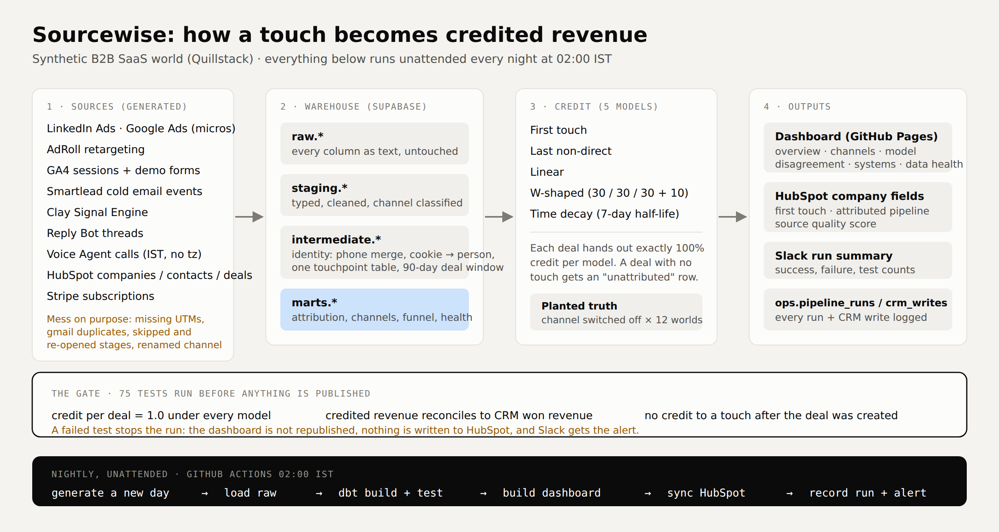

# Sourcewise — write-up

**Which GTM source actually produces revenue, and how much does the answer depend on how you count?**

All data is synthetic, generated from `config/world.yml` and regenerated nightly. No real companies, people
or revenue appear anywhere in this project.

Dashboard: https://lakshikanahar29-ctrl.github.io/sourcewise/ · Code: https://github.com/lakshikanahar29-ctrl/sourcewise

---

## Problem

Attribution reporting is usually a single number per channel, produced by one model nobody chose on purpose,
with no way to check whether it is right. Two things go wrong: the model picks the winner (last touch flatters
whatever happens last), and nobody can test the answer, because in the real world there is no answer key.

## Constraints

- Free tools only: Supabase, dbt Core, GitHub Actions, GitHub Pages, HubSpot free, Slack.
- No client data, so the world is simulated; the analysis has to be honest about that.
- It had to run unattended, because an attribution pipeline that needs babysitting is a spreadsheet.
- Deliberately out of scope: real ad-platform APIs, marketing mix modelling, Shapley attribution, multi-currency.

## What I built

A day-by-day simulation of a B2B SaaS company (600 accounts, ~2,400 people, 18 months) writes exports in the
shape of real tools — HubSpot, GA4, LinkedIn Ads, Google Ads in micros, AdRoll, Smartlead, Clay, a reply bot,
a voice agent in IST with no timezone, and Stripe. The mess is deliberate: missing UTMs, duplicate gmail
contacts, deals with no contact, skipped and re-opened stages, and a channel renamed mid-history.

dbt turns that into typed staging models, an identity layer (phone matching for duplicate contacts, cookies to
people, Clay rows matched on name + domain), one touchpoint table, and a 90-day account-based window per deal.
`fct_attribution` is stored long — one row per deal × model × touch — so adding a sixth model is rows, not a
schema change.

## How I measured it

Because the generator decides each channel's hidden effect, the truth is knowable: after the real run, the
world is re-simulated with each channel switched off, across 12 replicate worlds. The drop in won revenue is
that channel's expected incremental revenue. Only one model reads it, to score the others.

**Results on the current world (255 opportunities, 66 won, $1.70M won revenue — synthetic):**

| Channel | First touch | Last non-direct | W-shaped | True share |
|---|---|---|---|---|
| Direct | 39% | 11% | 51% | ~0% |
| Voice Agent | 19% | 46% | 15% | 26% |
| Retargeting | 1% | 19% | 6% | 1% |
| Signal Engine | 7% | 2% | 4% | 18% |

- **Direct is the biggest lie in the data.** Demo forms are submitted on direct visits, and those are the
  sessions identity resolution can attach to a person, so direct collects credit it did not earn.
- **Last-touch flatters anything that happens late.** The Voice Agent calls new leads within minutes, so
  last-touch gives it 46% against a true 26%. Retargeting gets 19% against a true 1%.
- **The Signal Engine is under-credited by every model** — roughly 4% under linear against a true 18%, because
  its touches are early and sparse.
- Scored against the truth, **first touch was closest (mean absolute error 8.2 points)** and **W-shaped worst
  (11.5)**. That ranking is a property of this world, not a general law.

**Data quality, reported rather than hidden:** 80% of paid clicks arrive with UTMs; 15% of web sessions stitch
to a known person; 4.4% of won revenue has no touch in the 90-day window; 34 gmail duplicates merged by phone;
4 won deals were marked closed-lost first and would be double counted by a history-based metric.

## What broke

Three real incidents so far, all in `docs/incident_log.md`:

1. **Second run failed at load.** Dropping raw tables collided with the dbt views built on them. Fixed by
   truncating in place when the export shape is unchanged.
2. **Gross revenue retention came out negative** for one channel, because a customer expanded and then churned
   at the higher MRR. Fixed by capping each customer at their starting MRR; recorded as v2 in `metrics.yml`.
3. **The first live HubSpot sync failed with a 400.** HubSpot only allows upsert on a property marked unique,
   and `domain` is not. Fixed by looking companies up by domain, then updating by record id and creating the
   rest, so re-runs stay idempotent. The dashboard stayed on the previous good version throughout, because the
   publish step only runs after everything passes.

## What it costs

Nothing in money: every service is on a free plan. About 3 minutes of compute per nightly run, most of it the
12 replicate simulations behind the truth table. At ten times the data volume the simulation and the SQL both
scale linearly, and the first thing to hit a limit would be Supabase's free 500 MB, not the models.

## AI authorship

The code was written with Claude, working from my design decisions: which sources to simulate, what mess to
plant, which models to implement, and what the tests must prove. I reviewed every model, chose the channel
taxonomy and scoring weights, and each of the three incidents above was found by running it rather than by
reading it.

## Version 2

- Data-driven (Shapley) attribution, scored against the same planted truth.
- A held-out period: fit the models on the first 12 months and score them on the last 6.
- Confidence bands on the truth table, since 12 replicates is a small sample for small channels.
- Lookback window as a dashboard control, so the reader can see credit move from 30 to 90 days.
